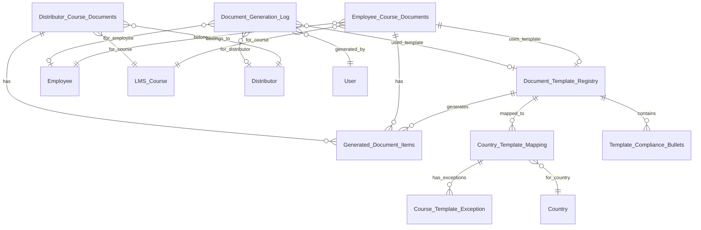

# Requirements Analysis: Dynamic Document Generation System

## Agent Metadata
- **Agent**: Requirements Analyst
- **Timestamp**: 2025-10-23T13:00:00Z
- **Next Agent**: Architecture Designer
- **Status**: COMPLETED
- **Handoff Key**: ARCH_DESIGN_Dynamic_Document_Generation_2025-10-23T13:00:00Z

## Business Requirements Summary

### Core Business Needs
The organization requires a comprehensive dynamic document generation system for managing country-specific employee declarations and completion certificates across multiple geographical regions. The current system is limited to hardcoded templates for 9 countries and needs to scale to support:

1. **11+ Country-Specific Templates**: Brazil, Germany, Italy, Nordic (Sweden), Poland, South Africa, Row1 & 2, Spain, Turkey, UK, plus International fallback
2. **Dynamic Template Selection**: Based on employee country and course type
3. **Multi-Role Support**: Employee and Distributor workflows with distinct document requirements
4. **Flexible Document Types**: Declaration forms and completion certificates with country-specific variations
5. **Version Control**: Template versioning for regulatory compliance tracking
6. **Audit Trail**: Complete document generation and submission history

### Stakeholder Requirements
- **Compliance Officers**: Need ability to configure country-specific templates and track document submissions
- **HR Administrators**: Require bulk document generation and employee compliance monitoring
- **Employees**: Simple interface for document preview, download, and upload
- **Distributors**: Separate workflow with division-specific documentation
- **System Administrators**: Template management, migration tools, and performance monitoring

### Success Criteria
- Support for unlimited country-specific templates without code changes
- Sub-second document generation response time
- 100% audit trail coverage for all document operations
- Zero-downtime template updates
- Backward compatibility with existing document records

## Technical Specifications

### DocTypes Required

#### 1. Document Template Registry (New)
```
DocType: Document Template Registry
Purpose: Central registry for all document templates with country/course mappings
Fields:
  - template_name (Data, Mandatory, Unique)
  - template_type (Select, Mandatory, Options: "Employee Declaration|Employee Certificate|Distributor Declaration|Distributor Certificate")
  - country (Link, Options: Country)
  - country_code (Data, Length: 10)
  - course_filter (Small Text, Description: "JSON filter for course matching")
  - priority (Int, Default: 0, Description: "Higher priority templates are selected first")
  - is_active (Check, Default: 1)
  - is_default (Check, Default: 0, Description: "Use as fallback template")
  - effective_from (Date, Mandatory)
  - effective_to (Date)
  - template_version (Data, Mandatory, Default: "1.0.0")
  - print_format (Link, Mandatory, Options: Print Format)
  - company_name (Data, Length: 255)
  - relationship_company (Data, Length: 255)
  - compliance_bullets (Table, Options: Template Compliance Bullets)
  - metadata_json (JSON, Description: "Additional template-specific metadata")
  - created_by (Link, Options: User, Read Only)
  - last_modified_by (Link, Options: User, Read Only)
```

#### 2. Template Compliance Bullets (Child Table)
```
DocType: Template Compliance Bullets
Purpose: Store compliance policy bullets for each template
Fields:
  - bullet_text (Text, Mandatory)
  - display_order (Int, Default: 0)
  - is_mandatory (Check, Default: 1)
  - policy_reference (Data, Length: 100)
```

#### 3. Document Generation Log (New)
```
DocType: Document Generation Log
Purpose: Audit trail for all document generation activities
Fields:
  - document_id (Data, Mandatory, Read Only, autoname: "DGL-.YYYY.-.#####")
  - user (Link, Mandatory, Options: User)
  - role_type (Select, Options: "Employee|Distributor|System Manager")
  - template_used (Link, Options: Document Template Registry)
  - template_version_used (Data, Read Only)
  - course (Link, Options: LMS Course)
  - employee (Link, Options: Employee)
  - distributor (Link, Options: Distributor)
  - generation_type (Select, Options: "Preview|Download|Upload|System Generated")
  - generation_status (Select, Options: "Success|Failed|Partial")
  - error_message (Text, Read Only)
  - file_reference (Attach)
  - generation_datetime (Datetime, Mandatory, Read Only)
  - ip_address (Data, Length: 45)
  - user_agent (Text)
  - processing_time_ms (Int)
```

#### 4. Document Template Variables (New)
```
DocType: Document Template Variables
Purpose: Define dynamic variables available in templates
Fields:
  - variable_name (Data, Mandatory, Unique)
  - variable_type (Select, Options: "Text|Number|Date|Link|Table")
  - source_doctype (Link, Options: DocType)
  - source_field (Data)
  - transformation_script (Code, Language: Python)
  - default_value (Small Text)
  - is_mandatory (Check, Default: 0)
  - description (Text)
```

#### 5. Enhanced Employee Course Documents (Modified)
```
Additional Fields:
  - selected_template (Link, Options: Document Template Registry)
  - template_version_used (Data, Read Only)
  - document_options_json (JSON, Description: "User-selected document generation options")
  - generated_documents (Table, Options: Generated Document Items)
  - compliance_officer (Link, Options: Employee)
  - compliance_review_status (Select, Options: "Pending|Approved|Rejected|Not Required")
  - compliance_review_date (Datetime)
  - compliance_review_notes (Text)
```

#### 6. Generated Document Items (Child Table)
```
DocType: Generated Document Items
Purpose: Track all documents generated for a course
Fields:
  - document_type (Select, Options: "Declaration|Certificate|Supporting Document")
  - template_used (Link, Options: Document Template Registry)
  - file_reference (Attach, Mandatory)
  - generation_date (Datetime, Mandatory)
  - is_current (Check, Default: 1)
  - replaced_by (Data)
  - replacement_reason (Text)
```

#### 7. Country Template Mapping (New)
```
DocType: Country Template Mapping
Purpose: Simplified UI for country-to-template mappings
Fields:
  - country (Link, Mandatory, Options: Country)
  - document_type (Select, Mandatory, Options: "Employee Declaration|Employee Certificate|Distributor Declaration|Distributor Certificate")
  - primary_template (Link, Mandatory, Options: Document Template Registry)
  - fallback_template (Link, Options: Document Template Registry)
  - course_exceptions (Table, Options: Course Template Exception)
  - is_active (Check, Default: 1)
  - notes (Text)
```

#### 8. Course Template Exception (Child Table)
```
DocType: Course Template Exception
Purpose: Define course-specific template overrides
Fields:
  - course_pattern (Data, Mandatory, Description: "Regex pattern or course name")
  - override_template (Link, Mandatory, Options: Document Template Registry)
  - priority (Int, Default: 0)
```

### Workflows

#### 1. Employee Document Generation Workflow
```yaml
Workflow: Employee Document Generation
States:
  - Draft: Initial state when course enrollment begins
  - Template Selection: System selects appropriate templates
  - Document Preview: User reviews document options
  - Document Generation: System generates selected documents
  - Compliance Review: Optional compliance officer review
  - Completed: Final state with all documents generated

Transitions:
  - From: Draft → To: Template Selection
    Action: Start Document Process
    Condition: Employee enrolled in course

  - From: Template Selection → To: Document Preview
    Action: Templates Selected
    Condition: Matching templates found

  - From: Document Preview → To: Document Generation
    Action: Confirm Selection
    Condition: User confirms document selection

  - From: Document Generation → To: Compliance Review
    Action: Submit for Review
    Condition: Compliance review required

  - From: Document Generation → To: Completed
    Action: Complete Process
    Condition: No compliance review required

  - From: Compliance Review → To: Completed
    Action: Approve Documents
    Condition: Compliance officer approves

Automation Rules:
  - Auto-select templates based on employee country and course
  - Auto-generate notification to compliance officer if review required
  - Auto-archive previous document versions
  - Auto-log all state transitions
```

#### 2. Distributor Document Generation Workflow
```yaml
Workflow: Distributor Document Generation
States:
  - Draft: Initial state
  - Division Selection: Select applicable divisions
  - Template Selection: System selects templates based on divisions
  - Document Generation: Generate selected documents
  - Signature Collection: Collect digital signatures
  - Completed: Final state

Transitions:
  - From: Draft → To: Division Selection
    Action: Start Process

  - From: Division Selection → To: Template Selection
    Action: Confirm Divisions

  - From: Template Selection → To: Document Generation
    Action: Confirm Templates

  - From: Document Generation → To: Signature Collection
    Action: Documents Generated

  - From: Signature Collection → To: Completed
    Action: Submit Signed Documents

Automation Rules:
  - Auto-populate divisions based on distributor profile
  - Auto-select division-specific templates
  - Auto-validate signature requirements
```

### Permissions & Roles

#### Role Permission Matrix

| Role | DocType | Read | Write | Create | Delete | Submit | Cancel | Amend |
|------|---------|------|-------|--------|--------|--------|--------|-------|
| System Manager | All Document DocTypes | ✓ | ✓ | ✓ | ✓ | ✓ | ✓ | ✓ |
| Compliance Officer | Employee Course Documents | ✓ | ✓ | ✗ | ✗ | ✓ | ✗ | ✗ |
| Compliance Officer | Document Generation Log | ✓ | ✗ | ✗ | ✗ | ✗ | ✗ | ✗ |
| Compliance Officer | Document Template Registry | ✓ | ✓ | ✓ | ✗ | ✗ | ✗ | ✗ |
| HR Manager | Employee Course Documents | ✓ | ✓ | ✓ | ✗ | ✓ | ✗ | ✗ |
| HR Manager | Document Generation Log | ✓ | ✗ | ✗ | ✗ | ✗ | ✗ | ✗ |
| Employee | Employee Course Documents (Own) | ✓ | ✓* | ✓ | ✗ | ✗ | ✗ | ✗ |
| Distributor | Distributor Course Documents (Own) | ✓ | ✓* | ✓ | ✗ | ✗ | ✗ | ✗ |
| Template Administrator | Document Template Registry | ✓ | ✓ | ✓ | ✓ | ✗ | ✗ | ✗ |
| Template Administrator | Country Template Mapping | ✓ | ✓ | ✓ | ✓ | ✗ | ✗ | ✗ |

*Limited write access to specific fields only

#### Field-Level Permissions

```python
Employee Course Documents:
  - Employee Role:
    - Read: All fields
    - Write: document_options_json, entered_name
    - No Write: compliance fields, template selection fields

  - Compliance Officer Role:
    - Read: All fields
    - Write: compliance_review_status, compliance_review_date, compliance_review_notes

Document Template Registry:
  - Template Administrator:
    - Full access to all fields
  - Others:
    - Read-only access
```

### API Requirements

#### 1. Template Selection API
```
Endpoint: POST /api/method/lms.document_generation.get_applicable_templates
Request:
{
  "user_type": "employee|distributor",
  "user_id": "string",
  "course": "string",
  "country": "string (optional override)",
  "include_inactive": false
}
Response:
{
  "templates": [
    {
      "template_id": "string",
      "template_name": "string",
      "template_type": "string",
      "priority": 0,
      "is_default": false,
      "metadata": {}
    }
  ],
  "default_selection": ["template_id"],
  "user_context": {
    "country": "string",
    "course_type": "string",
    "divisions": []
  }
}
```

#### 2. Document Generation API
```
Endpoint: POST /api/method/lms.document_generation.generate_documents
Request:
{
  "templates": ["template_id"],
  "user_type": "employee|distributor",
  "user_id": "string",
  "course": "string",
  "options": {
    "format": "pdf|docx",
    "include_watermark": false,
    "custom_fields": {}
  }
}
Response:
{
  "success": true,
  "documents": [
    {
      "template_id": "string",
      "document_type": "string",
      "file_url": "string",
      "file_name": "string",
      "generation_log_id": "string"
    }
  ],
  "generation_time_ms": 0
}
```

#### 3. Bulk Document Generation API
```
Endpoint: POST /api/method/lms.document_generation.bulk_generate
Request:
{
  "filter_criteria": {
    "country": "string",
    "course": "string",
    "date_range": {
      "from": "date",
      "to": "date"
    }
  },
  "document_types": ["declaration", "certificate"],
  "async": true
}
Response:
{
  "job_id": "string",
  "estimated_count": 0,
  "status_url": "string"
}
```

#### 4. Template Migration API
```
Endpoint: POST /api/method/lms.document_generation.migrate_templates
Request:
{
  "source_system": "legacy|v1",
  "dry_run": true,
  "mapping_rules": {
    "country_mapping": {},
    "template_mapping": {}
  }
}
Response:
{
  "migration_plan": {
    "templates_to_create": 0,
    "templates_to_update": 0,
    "conflicts": [],
    "estimated_time_seconds": 0
  }
}
```

#### 5. Document Validation API
```
Endpoint: POST /api/method/lms.document_generation.validate_document
Request:
{
  "document_id": "string",
  "validation_rules": ["signature", "completeness", "compliance"]
}
Response:
{
  "valid": true,
  "validation_results": {
    "signature": { "valid": true },
    "completeness": { "valid": true, "missing_fields": [] },
    "compliance": { "valid": true, "issues": [] }
  }
}
```

## Data Relationships

### Entity Relationship Model



### Foreign Key Specifications

```python
foreign_keys = {
    "Employee_Course_Documents": {
        "employee": ("Employee", "CASCADE"),
        "course": ("LMS Course", "RESTRICT"),
        "selected_template": ("Document Template Registry", "SET NULL"),
        "compliance_officer": ("Employee", "SET NULL")
    },
    "Document_Generation_Log": {
        "user": ("User", "CASCADE"),
        "template_used": ("Document Template Registry", "SET NULL"),
        "employee": ("Employee", "SET NULL"),
        "distributor": ("Distributor", "SET NULL"),
        "course": ("LMS Course", "SET NULL")
    },
    "Country_Template_Mapping": {
        "country": ("Country", "CASCADE"),
        "primary_template": ("Document Template Registry", "RESTRICT"),
        "fallback_template": ("Document Template Registry", "SET NULL")
    }
}
```

## Validation Rules

### Business Logic Validations

#### 1. Template Selection Validation
```python
def validate_template_selection(employee, course, templates):
    validations = {
        "country_match": {
            "rule": "Employee country must match template country or template must be international",
            "severity": "ERROR"
        },
        "date_effectiveness": {
            "rule": "Current date must be between template effective_from and effective_to",
            "severity": "ERROR"
        },
        "course_compatibility": {
            "rule": "Course must match template course_filter if specified",
            "severity": "ERROR"
        },
        "template_active": {
            "rule": "Template must be marked as active",
            "severity": "ERROR"
        },
        "priority_order": {
            "rule": "Higher priority templates must be selected over lower priority",
            "severity": "WARNING"
        }
    }
    return validations
```

#### 2. Document Generation Validation
```python
def validate_document_generation(document_data):
    validations = {
        "required_fields": {
            "rule": "All mandatory template variables must have values",
            "fields": ["employee_name", "course_title", "date"],
            "severity": "ERROR"
        },
        "data_types": {
            "rule": "Variable values must match defined data types",
            "severity": "ERROR"
        },
        "compliance_bullets": {
            "rule": "All mandatory compliance bullets must be included",
            "severity": "ERROR"
        },
        "signature_requirements": {
            "rule": "Signature fields must be populated for distributor documents",
            "severity": "ERROR"
        }
    }
    return validations
```

#### 3. Workflow Transition Validation
```python
def validate_workflow_transition(from_state, to_state, user_role):
    validations = {
        "role_permission": {
            "rule": "User role must have permission for transition",
            "severity": "ERROR"
        },
        "state_sequence": {
            "rule": "Transition must follow defined workflow sequence",
            "severity": "ERROR"
        },
        "required_data": {
            "rule": "All required data for target state must be present",
            "severity": "ERROR"
        },
        "compliance_review": {
            "rule": "Compliance review required for specific countries/courses",
            "condition": "country in ['Germany', 'Italy'] or course_type == 'Medical Device'",
            "severity": "WARNING"
        }
    }
    return validations
```

### Data Integrity Constraints

```sql
-- Unique Constraints
ALTER TABLE `tabDocument Template Registry`
ADD UNIQUE KEY `unique_template_name` (`template_name`);

ALTER TABLE `tabCountry Template Mapping`
ADD UNIQUE KEY `unique_country_doctype` (`country`, `document_type`);

-- Check Constraints
ALTER TABLE `tabDocument Template Registry`
ADD CONSTRAINT `check_dates` CHECK (`effective_to` IS NULL OR `effective_to` > `effective_from`);

ALTER TABLE `tabDocument Generation Log`
ADD CONSTRAINT `check_user_type` CHECK (
    (`employee` IS NOT NULL AND `distributor` IS NULL) OR
    (`employee` IS NULL AND `distributor` IS NOT NULL) OR
    (`employee` IS NULL AND `distributor` IS NULL)
);

-- Referential Integrity
ALTER TABLE `tabGenerated Document Items`
ADD CONSTRAINT `fk_template` FOREIGN KEY (`template_used`)
REFERENCES `tabDocument Template Registry` (`name`) ON DELETE SET NULL;
```

## Reporting Requirements

### Dashboard Specifications

#### 1. Document Generation Dashboard
```yaml
Dashboard: Document Generation Overview
Metrics:
  - Total Documents Generated (Today/Week/Month)
  - Generation Success Rate
  - Average Generation Time
  - Documents by Country (Pie Chart)
  - Documents by Type (Bar Chart)
  - Peak Generation Hours (Heat Map)

Filters:
  - Date Range
  - Country
  - Document Type
  - User Role
  - Course

Drill-down:
  - Click on country → Country-specific details
  - Click on document type → Template usage statistics
```

#### 2. Compliance Monitoring Dashboard
```yaml
Dashboard: Compliance Status Monitor
Metrics:
  - Pending Compliance Reviews
  - Review Turnaround Time
  - Compliance by Country (Map View)
  - Rejection Rate by Template
  - Compliance Officer Workload

Alerts:
  - Reviews pending > 48 hours
  - High rejection rate (> 10%)
  - Template expiration warnings
```

### Report Formats

#### 1. Document Generation Report
```python
report_config = {
    "name": "Document Generation Report",
    "doctype": "Document Generation Log",
    "columns": [
        "generation_datetime",
        "user",
        "role_type",
        "template_used",
        "course",
        "generation_status",
        "processing_time_ms"
    ],
    "filters": [
        {"fieldname": "generation_datetime", "fieldtype": "DateRange"},
        {"fieldname": "role_type", "fieldtype": "Select"},
        {"fieldname": "generation_status", "fieldtype": "Select"}
    ],
    "aggregations": {
        "total_documents": "COUNT(*)",
        "avg_processing_time": "AVG(processing_time_ms)",
        "success_rate": "SUM(CASE WHEN generation_status='Success' THEN 1 ELSE 0 END)/COUNT(*)"
    },
    "export_formats": ["PDF", "Excel", "CSV"]
}
```

#### 2. Template Usage Analytics
```python
analytics_config = {
    "name": "Template Usage Analytics",
    "metrics": [
        "usage_count_by_template",
        "template_selection_patterns",
        "fallback_template_usage",
        "template_performance_metrics"
    ],
    "visualizations": [
        {"type": "line_chart", "metric": "usage_over_time"},
        {"type": "heatmap", "metric": "country_template_correlation"},
        {"type": "funnel", "metric": "document_workflow_completion"}
    ]
}
```

### Analytics Requirements

```python
analytics_requirements = {
    "real_time_metrics": [
        "active_document_generations",
        "queue_length",
        "error_rate"
    ],
    "historical_analysis": [
        "template_evolution",
        "compliance_trends",
        "user_behavior_patterns"
    ],
    "predictive_analytics": [
        "peak_load_forecasting",
        "template_maintenance_scheduling",
        "compliance_risk_scoring"
    ],
    "data_retention": {
        "logs": "90 days",
        "aggregated_metrics": "2 years",
        "compliance_records": "7 years"
    }
}
```

## Migration Strategy

### Phase 1: Data Preparation
1. Export existing template mappings from hardcoded function
2. Create Document Template Registry entries for existing 9 countries
3. Map existing print formats to new template registry
4. Validate all existing Employee Course Documents have template references

### Phase 2: Parallel Run
1. Deploy new system in shadow mode
2. Log both old and new template selections for comparison
3. Validate template selection accuracy
4. Performance testing with production load

### Phase 3: Cutover
1. Enable new template selection system
2. Migrate historical records to include template references
3. Decommission hardcoded template functions
4. Update all API endpoints to use new system

### Phase 4: Enhancement
1. Add remaining country templates (Nordic, Row1&2, etc.)
2. Implement advanced features (versioning, A/B testing)
3. Enable self-service template management
4. Deploy analytics dashboards

## User Experience Workflow

### Employee Document Workflow
```
1. Course Enrollment
   → System auto-detects employee country
   → Identifies applicable templates

2. Document Selection Interface
   → Display available documents with descriptions
   → Show preview button for each document
   → Allow selection of specific documents

3. Document Preview
   → Real-time PDF preview in modal
   → Option to download or go back

4. Document Generation
   → Generate selected documents
   → Show progress indicator
   → Log generation activity

5. Document Access
   → Download generated documents
   → Upload signed copies if required
   → View submission history
```

### Administrator Workflow
```
1. Template Management
   → Upload new templates
   → Configure country mappings
   → Set effective dates

2. Monitoring
   → View generation statistics
   → Monitor error rates
   → Track compliance status

3. Bulk Operations
   → Generate documents for multiple users
   → Export compliance reports
   → Archive old documents
```

## Performance Considerations

### Optimization Strategies
1. **Template Caching**: Cache compiled templates in Redis with 1-hour TTL
2. **Async Generation**: Queue bulk operations using RQ for background processing
3. **CDN Distribution**: Store generated PDFs in CDN for faster retrieval
4. **Database Indexing**: Index on (country, course, is_active) for template selection
5. **Connection Pooling**: Implement connection pooling for high-concurrency scenarios

### Scalability Targets
- Support 10,000 concurrent users
- Generate 1,000 documents per minute
- Sub-second template selection response time
- 99.9% availability SLA

## Security Considerations

### Data Protection
1. **Encryption**: AES-256 encryption for stored documents
2. **Access Control**: Row-level security based on user role and ownership
3. **Audit Logging**: Comprehensive logging of all document operations
4. **PII Handling**: Automatic redaction of sensitive information in logs
5. **Compliance**: GDPR and regional data protection compliance

### Authentication & Authorization
1. Two-factor authentication for template administrators
2. API key rotation every 90 days
3. Session timeout after 30 minutes of inactivity
4. IP whitelisting for administrative operations

## Handoff Instructions

The Architecture Designer Agent should use handoff key: ARCH_DESIGN_Dynamic_Document_Generation_2025-10-23T13:00:00Z

### Next Steps for Architecture Designer:
1. Design system architecture for template management service
2. Create component diagrams for document generation pipeline
3. Define microservice boundaries if applicable
4. Specify caching strategy and infrastructure requirements
5. Design API gateway configuration
6. Create deployment architecture for multi-region support
7. Define monitoring and alerting architecture
8. Specify backup and disaster recovery architecture

### Key Technical Decisions Required:
1. Template engine selection (Jinja2 vs custom)
2. PDF generation library (WeasyPrint vs ReportLab)
3. Storage solution for generated documents (S3 vs local)
4. Queue system for async processing (RQ vs Celery)
5. Caching layer (Redis vs Memcached)
6. Search engine for template discovery (Elasticsearch vs PostgreSQL FTS)

### Critical Requirements to Address:
1. Multi-tenant architecture support
2. Horizontal scaling capabilities
3. Zero-downtime deployment strategy
4. Real-time template hot-reloading
5. Geographic distribution of templates
6. Compliance with healthcare regulations (if applicable)
7. Integration with existing Frappe permission system
8. Backward compatibility with existing documents

---

*This requirements analysis provides a comprehensive blueprint for implementing a scalable, maintainable, and user-friendly dynamic document generation system within the Frappe framework.*